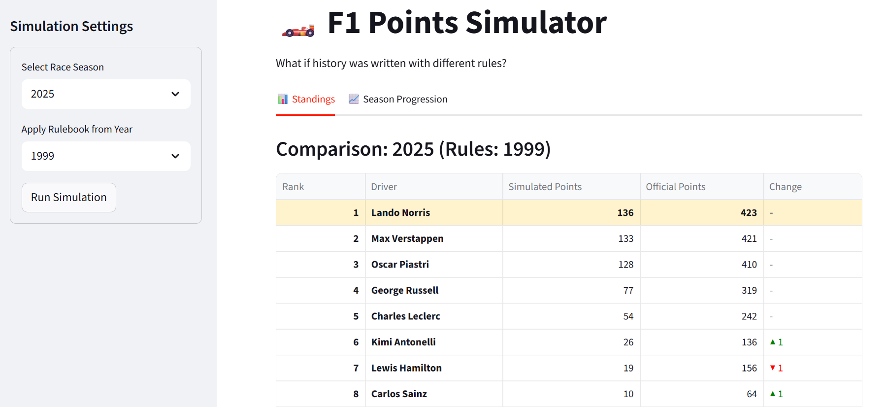
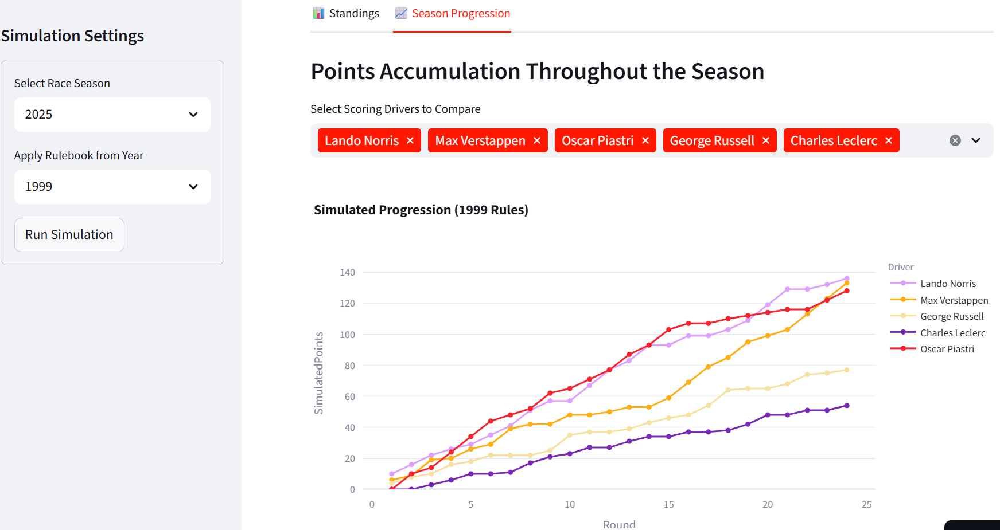

# Project Portfolio: Formula 1 Points Simulator

## 1. Project Overview <a name="project-overview"></a>
The **Formula 1 Points Simulator** is an interactive data application designed to explore the "What-If" scenarios of sporting history. Since 1950, Formula 1 has overhauled its scoring regulations more than 15 times, often fundamentally altering how champions are crowned. This project decouples 75 years of historical race results from the specific rules of their era.

🔗 **Explore the Simulator:** [f1-points-simulator.streamlit.app](https://f1-points-simulator.streamlit.app/)

---

## Table of Contents
* [1. Project Overview](#project-overview)
* [2. Technical Stack](#️technical-stack)
* [3. Data Sources and Historical Foundation](#data-overview)
* [4. Data Architecture and Engineering Challenges](#data-architecture)
* [5. Visual Analytics and UI Logic](#visual-analytics)
* [6. Final Outcomes and Impact](#results)

---

## 2. Technical Stack <a name="technical-stack"></a>
* **Language:** Python 3.11
* **Data Engineering:** FastF1, Pandas, NumPy
* **Storage:** Apache Parquet (via PyArrow)
* **Visualization:** Plotly Express
* **Interface:** Streamlit
* **Deployment:** Streamlit Cloud

---

## 3. Data Sources and Historical Foundation <a name="data-overview"></a>
The integrity of the simulator depends on the accuracy of its underlying data. Every simulated point is grounded in the reality of past races.

### Reliable Data Acquisition
This project utilises the **FastF1** library, a professional-grade Python tool used to interface with official Formula 1 archives.
* **Verified Accuracy**: FastF1 provides high-fidelity results for race finishes, lap times, and session statuses directly from official F1 timing sources.
* **Comprehensive Scope**: The database includes every classified finishing position, fastest lap record, and sprint race result across 75 years of competition.
* **Standardised Records**: Using a standardised library ensures that driver and constructor identities remain consistent, even as teams changed names or merged over decades.

### The Official Scoring Systems
To maintain authenticity, the **Official F1 Scoring Systems** have been used, including the proper drop rules, one-off scenarios, and half points for shorter races. The engine replicates the exact mathematical evolution of the FIA regulations:
* **The Classic Era (1950–1959)**: Systems where only the top 5 scored and points were awarded for the fastest lap.
* **Drop-Score Logic (Pre-1991)**: Replicates the historical requirement where only a driver's best results (e.g., best 11 of 16) counted toward the title.
* **Modern Complexity (2010–Present)**: Includes the 25-18-15 system, fastest lap points (with top-10 finish restrictions), and the various iterations of Sprint Race points.

---

## 4. Data Architecture and Engineering Challenges <a name="data-architecture"></a>
The technical core is built on a robust pipeline designed for high performance in a cloud environment.

### From Raw Extraction to Optimized Storage
The architecture follows a specialized ETL (Extract, Transform, Load) pattern:
* **Extraction**: `builder.py` pulls raw data using FastF1 and pre-processes it for simulation readiness.
* **The Case for Apache Parquet**: A pivotal decision was moving away from live API dependencies in favor of a local **Apache Parquet** database. 
    * **Performance**: Columnar storage allows the simulator to read only the necessary data for calculations, drastically reducing memory overhead.
    * **Reliability**: Hosting Parquet files within the repository ensures the app is immune to external API outages or rate-limiting.

```python
@st.cache_data
def load_season_data(year):
    file_path = f"data/processed/{year}_results.parquet"
    try:
        df = pd.read_parquet(file_path)
        df['points'] = df['points'].astype(float)
        return df
    except FileNotFoundError:
        return None
```

* **Decoupling Results from Rules**: The engine separates the **Reality** (Who finished where) from the **Filter** (What those positions are worth). This allows for the dynamic "Rule Swap" functionality.

```python
df['BasePoints'] = df.apply(lambda r: calculate_base_points(r, points_list, data_year, rule_year, total_rounds), axis=1)
df['BonusPoints'] = df.apply(lambda r: calculate_bonus_points(r, rule_year, total_rounds, fl_counts, data_year), axis=1)
df['TotalPoints'] = df['BasePoints'] + df['BonusPoints']
```

### Critical Logic & Technical Solutions
* **The "Drop-Score" Complexity**: Replicating the pre-1991 requirement was a significant challenge. The engine must calculate all potential points, identify the lowest-scoring rounds for each driver, and subtract them to find the "Official" total.

```python
rule = get_rule_for_year(rule_year, DROP_RULES)
if rule == "all":
    standings = df.groupby(id_col)['TotalPoints'].sum()
elif isinstance(rule, int):
    standings = (df.sort_values('TotalPoints', ascending=False)
                    .groupby(id_col)['TotalPoints']
                    .apply(lambda x: x.head(rule).sum()))
elif "split" in rule:
    h1_lim, h2_lim = map(int, rule.split('_')[1:])
    mid = total_rounds // 2
    h1 = (df[df['Round'] <= mid].sort_values('TotalPoints', ascending=False)
            .groupby(id_col)['TotalPoints'].apply(lambda x: x.head(h1_lim).sum()))
    h2 = (df[df['Round'] > mid].sort_values('TotalPoints', ascending=False)
            .groupby(id_col)['TotalPoints'].apply(lambda x: x.head(h2_lim).sum()))
    standings = h1.add(h2, fill_value=0)
```
* **Handling Non-Integer Results**: Historical anomalies like the **1954 British GP** (7 drivers sharing a fastest lap) or **Half-Points races** required the engine to support floating-point arithmetic to maintain 100% historical accuracy.
* **Computational State Management**: To prevent the engine from re-calculating 75 years of data for every UI click, I implemented **Streamlit Session State** to cache simulation results.

---

## 5. Visual Analytics and UI Logic <a name="visual-analytics"></a>
A primary goal of this project was to transform raw simulated data into a compelling visual narrative. The interface was designed to allow users to instantly grasp the impact of a rule change without getting lost in the mathematical complexity.



* **The Rank Delta System**: The results table compares the official historical rank against the simulated rank, using visual cues—green (▲) for gained and red (▼) for lost—to highlight performance shifts.The interface also automatically applies a distinct gold background and bold formatting to the "Simulated Champion," clearly signaling when a title has changed hands.
* **High-Capacity Season Progression**: The core of the user experience is the **Dynamic Progression Chart**, which visualizes how points accumulate round-by-round. Handling 75 years of data meant dealing with seasons that had vastly different grid sizes. The engine performs a `groupby` followed by a `cumsum()` to transform individual race results into a running total, allowing users to identify "turning points" where one driver overtook another in the standings.



* **State Management Challenge**: A major technical hurdle was Streamlit's default behavior of re-running the entire script—and the scoring engine—upon every user interaction. I migrated the architecture to a **Session State** model. By storing simulation results in the app's state, UI interactions like chart filtering now happen instantaneously without re-triggering the scoring logic.
* **Contextual Storytelling (Anomaly Alerts)**: The UI detects "anomaly years" and displays informational notes explaining unique historical contexts, such as the vacant podium spots in the 1983 Brazilian GP.

---

## 6. Final Outcomes and Impact <a name="results"></a>
The **F1 Points Simulator** reveals how much the "Official" history of the sport is a product of its specific regulatory environment.

### Key Historical Discoveries
* **The 1988 Title Reversal**: The simulator confirms that under modern scoring (without "Drop-Scores"), Alain Prost would have been champion over Ayrton Senna.
* **The 2014 "Double Points" Validation**: Users can strip away the controversial 2014 double-points rule to see if Lewis Hamilton would still have secured his second title.
* **Legacy of the "Gentleman Driver"**: Modern scoring reveals that many 1950s privateers were consistent performers whose contributions were mathematically erased by the restrictive scoring systems of their time.

### Conclusion
This project bridges the gap between raw data engineering and digital sports journalism. It provides a platform for fans to see that while "The Winner" is defined by the trophy, "The Best" is often a matter of which rulebook you choose to follow.